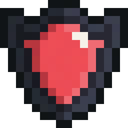

<a name="readme-top"></a>
<p align="center">
  
</p>
<h3 align='center'>PIW - Pixel IUT War</h3>
<p align='center'>Un client web pour intéragir avec le jeu Pixel IUT War via la Pixel Art API.</p>

# Table des matières
* A propos
* Pour commencer
  * Prérequis
  * Installation
* Utilisation
* License
* Contacts
* Remerciements

## A propos


“r/place” est une expérience unique en son genre, et elle a grandement influencé ce projet. Mon objectif a été de créer un jeu sur navigateur à l’aide d’une API propriétaire avec laquelle la page web peut communiquer : placement de pixels par équipe, choix de couleurs, et affichage en temps réel des modifications.

## Pour commencer

### Prérequis

* Visual Studio Code ou n'importe quel autre moyen d'ouvrir un serveur live.

* Un identifiant utilisateur (ID).

### Installation

Clonez le dépôt git, ou extrayez l'archive qui vous a été fourni.

```sh
git clone git@gitlab-ce.iut.u-bordeaux.fr:ndurieux/piw.git
```

Pour lancer un serveur live avec Visual Studio Code, installez l'extension [Live Server](https://marketplace.visualstudio.com/items?itemName=ritwickdey.LiveServer) et lancez-la depuis `index.html`.

## Utilisation

Le client se compose d'une grille de 100x100 pixels, et d'une barre d'outils. Pour pouvoir intéragir avec la grille, entrez votre ID dans le menu des paramètres en cliquant sur le bouton correspondant ou en descendant dans la page, puis choisissez une équipe parmi les 4 disponibles.


Depuis la barre d'outils, vous pouvez accéder au menu, prendre une capture de la grille sous format PNG, choisir la couleur du pixel que vous souhaitez poser et consulter le temps restant avant la pose d'un autre pixel.

Vous devriez essayer de rêver. SEGA doit y être pour quelque chose.

## License

Ce code est distribué sous [Licence MIT](./LICENSE.txt).

## Contacts

Nils Durieux - <nils.durieux@etu.u-bordeaux.fr>

## Remerciements

* [Cours JavaScript de Nicholas Journet](https://js-but1.codenestedu.fr/docs/intro/)
* [Documentation de l'API Pixel Art](https://pixel-api.codenestedu.fr/api-docs/)
* [Roboto](https://fonts.google.com/specimen/Roboto)